# DOCUMENTATION TECHNIQUE VERSION 2
:toc: left
:toc-title: Table des matières
:icons: font
:nofooter:

Version de l’application : 2
Date : semaine 20
Equipe : Christopher / Ruben / Yann 
Client : BankUniv
Projet : DailyBank

## Présentation générale

### Répartition du travail 

[cols="1,1,1,1,1,1,1"]
|===
|Version |User |Use case |Fonctionnalité |Christopher |Ruben |Yann

|1
|Guichetier
|créditer / débiter un compte
|Enregistrer un débit
|
|
|F

|1
|Guichetier
|créditer / débiter un compte
|Enregistrer un crédit 
|
|
|F

|1
|Guichetier
|effectuer un virement d'un compte à un compte
|Réaliser un virement
|
|
|F

|1
|Guichetier
|modifier info compte
|Modifier un compte bancaire
|F
|
|

|1
|Guichetier
|clôturer / réactiver un compte
|Clôturer un compte bancaire
|
|F
|

|1
|Guichetier
|clôturer / réactiver un compte
|Réactiver un compte bancaire
|
|F
|

|1
|Guichetier
|créer un compte
|Créer un nouveau compte bancaire
|F
|
|

|1
|Guichetier
|modifier info client
|Modifier un client
|
|
|

|1
|Guichetier
|désactiver / réactiver un client
|Désactiver un client
|
|F
|

|1
|Guichetier
|désactiver / réactiver un client
|Réactiver un client
|
|F
|

|1
|Employé
|Gérer le crud des employés
|Modifier un employé
|F
|
|

|1
|Employé
|Gérer le crud des employés
|Désactiver un employé
|F
|
|

|1
|Employé
|Gérer le crud des employés
|Créer un nouvel employé
|F
|
|

|2
|Guichetier
|simuler un emprunt
|Simuler emprunt
|
|F
| 

|2
|Guichetier
|gérer les prélévements automatique
|Réaliser un prélévement automatique
|
|
|D

|2
|Guichetier
|effectuer un débit exceptionnel
|Réaliser un débit exceptionnel
|
|
|F 

|2
|Guichetier
|générer un relevé mensuel d'un compte en PDF
|Générer un relevé bancaire PDF
|F
|
| 
|===
F : Fonctionnel ; D : Développement

### Use Case global

.figure 1 : image de l'use case global
image:img-doc_tech/use-case.png[]

L'utilisation de l'application DailyBank se fait par deux utilisateurs distincts : 

*Les guichetiers* : Ils possèdent les droits leur permettant de gérer les clients de l'Agence bancaire ainsi que leur comptes. +
Ainsi ils peuvent :

* gérer les clients de l'Agence bancaire :

** Rechercher les clients 
** consulter les comptes bancaire d'un client

*** gérer les opérations d'un compte bancaire d'un client 

**** enregistrer un débit
**** enregistrer un crédit
**** réaliser un virement

** modifier les information d'un compte bancaire d'un client
** clôturer un compte bancaire d'un client
** réactiver un compte bancaire d'un client
** créer un nouveau compte bancaire pour un client

* modifier les informations d'un client
* désactiver un client
* réactiver un client
* créer un nouveau client

*Les Chefs d'Agence* : Ils possèdent les mêmes droits que les guichetiers et gèrent en plus les employés. +
Ainsi ils peuvent : 

* gérer les employés de l'agence :

** rechercher les employés de l'agence
** modifier les informations d'un employé
** désactiver un employé
** créer un nouvel employé

### Diagramme de classe de données 

.figure 2 : image du diagramme de classe global
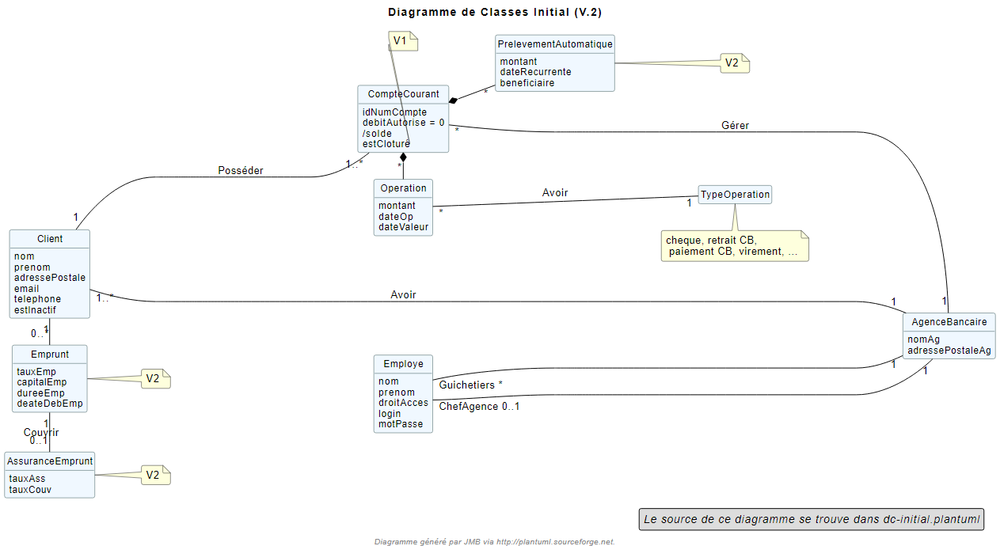

Une agence bancaire peut posséder plusieurs clients qui possédent un certain nombres de comptes bancaire. Ces comptes bancaires peuvent avoir réalisé un certain nombre d'opérations.

## Architecture

### Architecture générale

L'application est développer en utilisant le langage de programmation Java dans sa version 1.8, son framework JavaFX qui permet de mettre en place l'interface graphique, ainsi qu'une base de données Oracle. +
Elle est utilisée pour permettre au employés d'une Agence bancaire comprise parmis celles de DailyBank, de gérer les clients de leur Agence ainsi que leur comptes bancaire et les opérations de ces comptes. +
De la même manière, elle permet aux employés possédant les droits nécessaire de gérer les employés de leur Agence bancaire. 

### Ressources externes 

Plusieurs fichier .jar ayant des rôles précis sont utilisés pour cette application :

* DailyBankApp.jar : il permet de lancer l'application pour l'utiliser

* itextpdf-5.4.0.jar : librairie pour générer des documents PDF en java

### Structuration en packages

* Application : +
Continent les fichiers en .java qui permettent de lancer l'application.

* Application.control : +
Contient les contrôleurs de dialogue permettant l'accès aux données de l'application. En d'autres termes, il contient tous les fichiers .java permettant de représenter toutes les fenêtres de l'application.

* Application.view : +
Continent toutes les vues de l'application, c'est à dire tous les classes .fxml ainsi que les controlleurs associés. En d'autres termes, il contient tous les classes permettant l'interaction avec l'application (gestion des vues et contrôles des saisies)

* Application.tools : +
Contient tous les classes utilisé pour le package view et le package control.

* Model.data : +
Contient les classes permettant d'intéragir avec la Base de Données puisque les classes de ce package représente les tables de la Base de Données.

* Model.orm : +
Continent toutes les classes qui permettent d'effectuer des requêtes SQL dans la Base de Données. 

* Model.exception : +
Contient toutes les classes qui gère les différentes exception de l'application.

## Fonctionnalités de l'application

### Connexion / Deconnexion d'un compte

NOTE: Fonctionnalité de la version existante 

*Classes impliquées dans chaque package :*

* package application.control :
** DailyBankMainFrame.java
* package application.view :
** DailyBankMainFrameController.java
* package model.data :
** AgenceBancaire.java
* package model.orm :
** LogToDataBase.java

En cliquant sur le bouton « connexion » ou « deconnexion » le contrôleur de vue DailyBankMainFrameController va transmettre les informations au contrôleur DailyBank qui va soit afficher une fenêtre d'identification grâce à la méthode login ou bien déconnecter direment le compte grâce à la méthode disconnect.

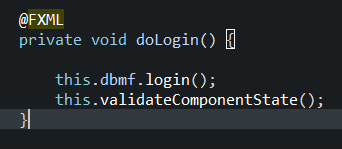

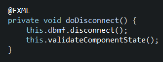

Ce sont ces fonction qui font appel aux méthodes login et disconnect de la classe DailyBankMainFrame :

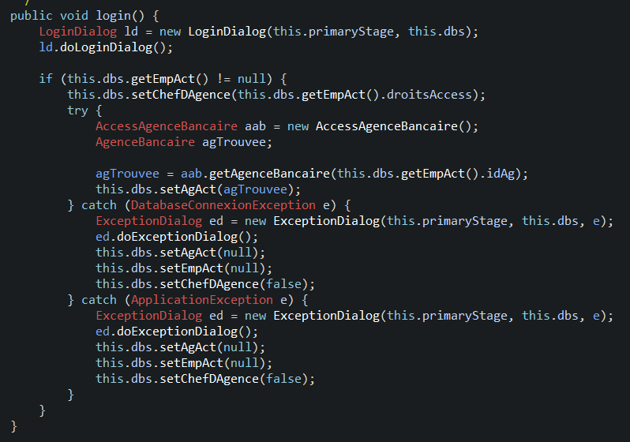

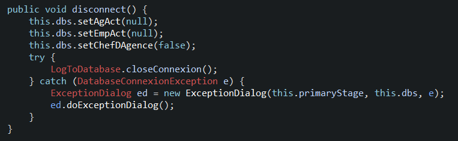

*Copies d'écran principale de la fonctionnalité :*

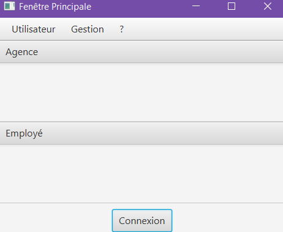

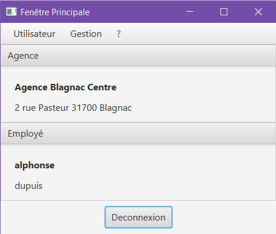

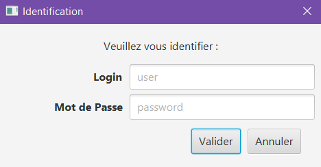

### Gestion des clients 

NOTE: Fonctionnalité de la version existante

*Partie du Use case concerné :*

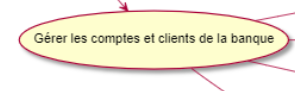

*Classes impliquées dans chaque package :*

* package application.control :
** ClientManagement.java
** DailyBankMainFrame.java
* package application.view :
** ClientManagementController.java
** DailyBankMainFraiController.java

En cliquant sur le bouton « clients » le contrôleur de vue DailyBankMainFrameController va transmettre les informations au contrôleur DailyBankMainFrame grâce à la fonction doClientOption. +
Quant à lui le contrôleur DailyBankMainFrame transmet les informations au contrôleur ClientManagement grâce à la fonction gestionClient qui fait appel à la méthode doClientManagementDialog qui permet d'afficher la fenêtres de gestion des clients. 

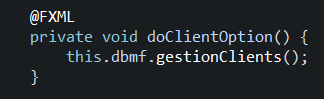

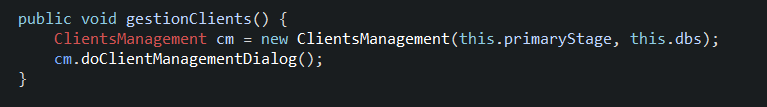

image:img-doc_tech/gestionclient-code3.png[]

*Copies d'écran principale de la fonctionnalité :*

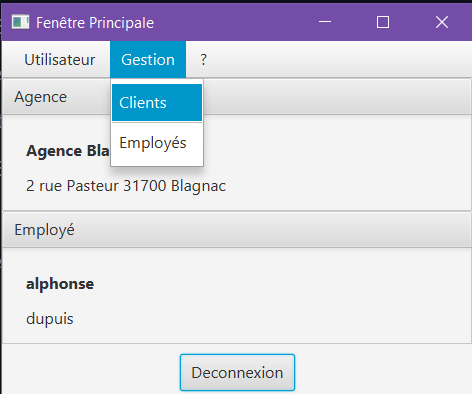

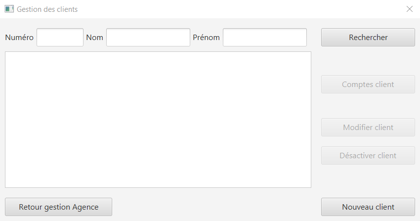

### Recherche des clients

NOTE: Fonctionnalité de la version existante

*Classes impliquées dans chaque package :*

* package application.view :
** ClientManagementController.java
* model.orm :
** AccessClient.java

En cliquant sur le bouton « rechercher » le contrôleur de vue ClientManagementController va transmettre les informations à la classe AccessClient qui va permettre d'afficher la liste des clients grâce à la méthode getClients.

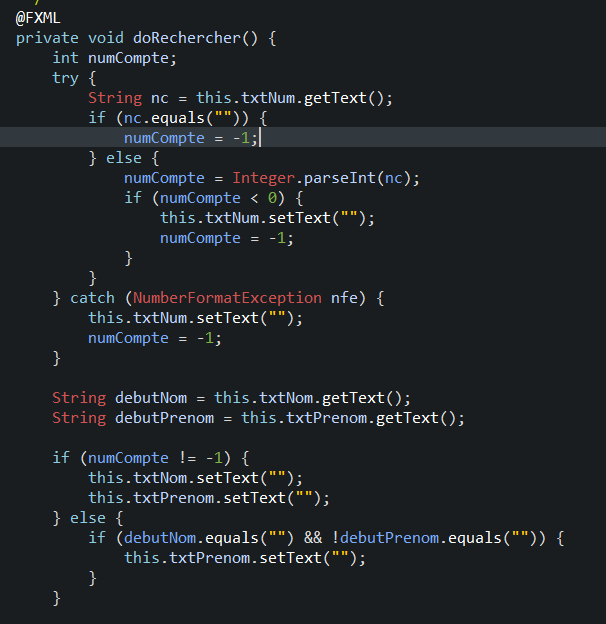

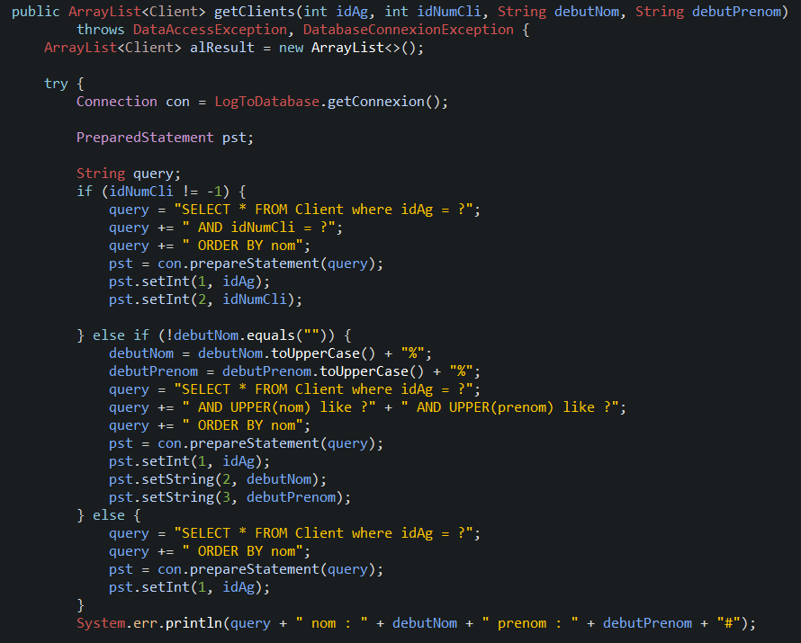
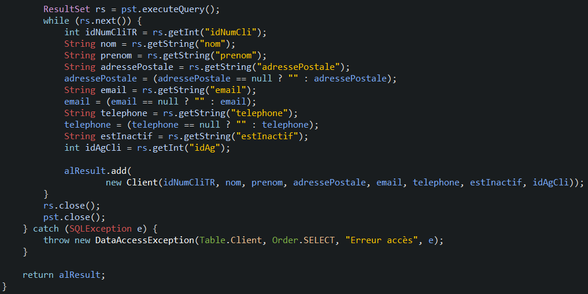

*Copies d'écran principale de la fonctionnalité :*

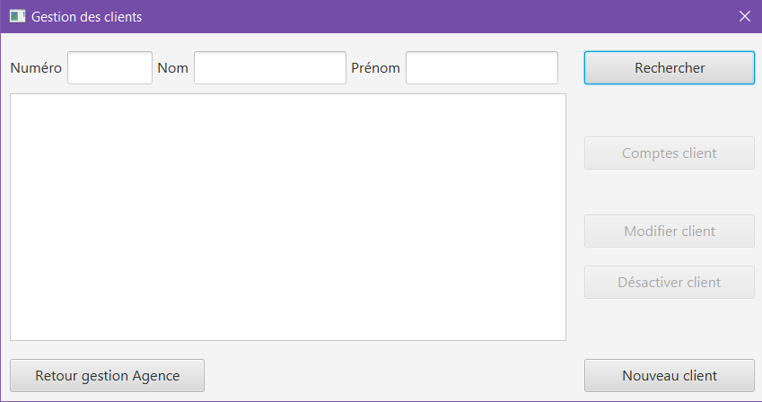

### Gestion des comptes bancaire

NOTE: Fonctionnalité de la version existante

*Partie du Use case concerné :*

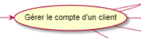

*Classes impliquées dans chaque package :*

* package application.control :
** ClientManagement.java
** ComptesManagement.java
* package application.view :
** ComptesManagementController.java
* package model.orm :
** AccessCompteCourant.java

En cliquant sur le bouton « comptes client » le contrôleur de vue ClientManagementController transmet les informations au contrôleur ClientManagement qui va permettre d'afficher la fenêtre de gestion des comptes bancaire d'un client en faisant appel à la méthode doComptesManagementDialog de la classe CompteManagement

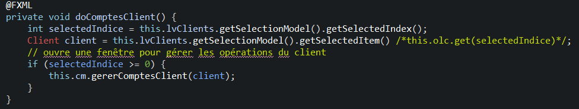

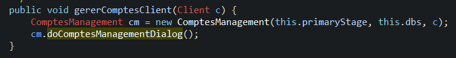

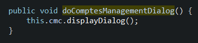

*Copies d'écran principale de la fonctionnalité :*

image:img-doc_tech/gererCompteBancaire1.png[]

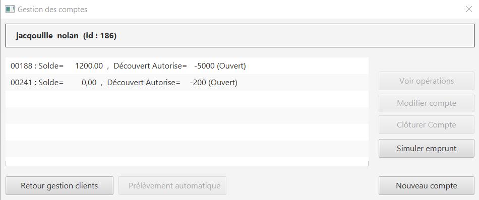

### Voir les opérations d'un compte bancaire

NOTE: Fonctionnalité de la version existante

*Classes impliquées dans chaque package :*

* package application.control :
** ComptesManagement.java
* package application.view :
** ComptesManagementController.java
* package model.orm :
** AccessOperation.java

En cliquant sur le bouton « voir opérations » le contrôleur de vue ComptesManagementController transmet les informations au controleur ComptesManagement qui va permettre d'afficher la fenêtre de gestion des opérations grâce à la fonction gererOperation qui fait appel a la méthode doOperationManagementDialog du contrôleur OperationManagement. +
De plus pour afficher directement les opérations sur la fenêtre, nous utilisons la méthode getOperations de la classe AccessOperation.

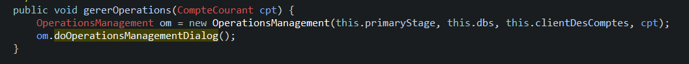

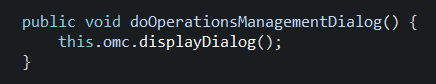

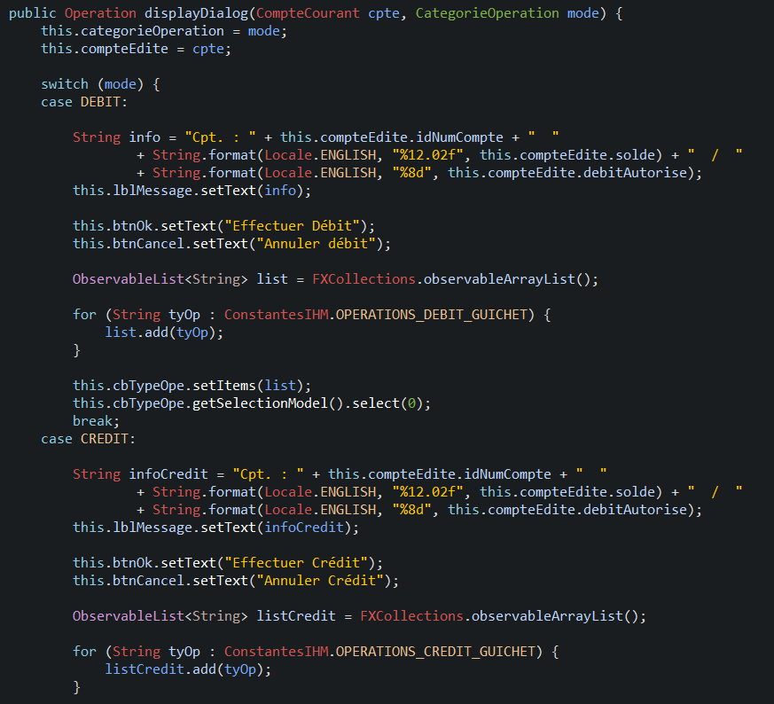
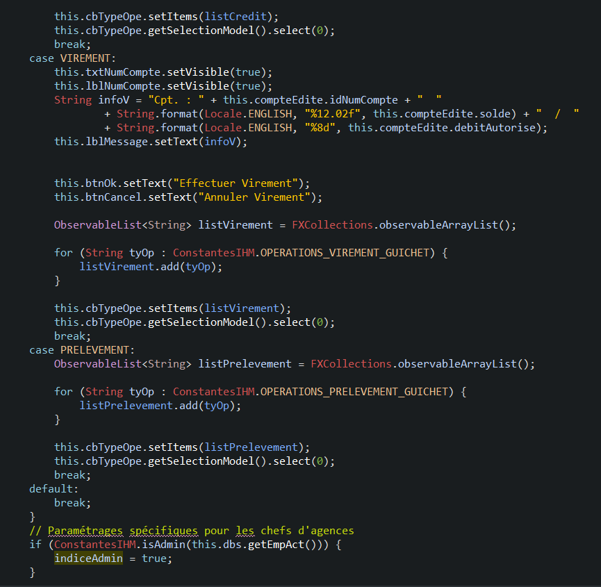
image:img-doc_tech/gererOperation-code5.png[]

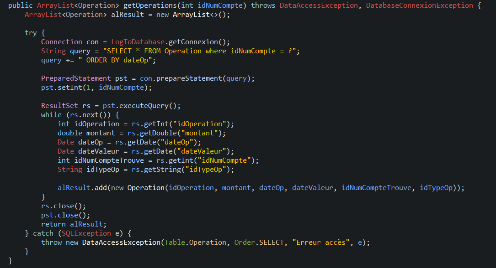

*Copies d'écran principale de la fonctionnalité :*

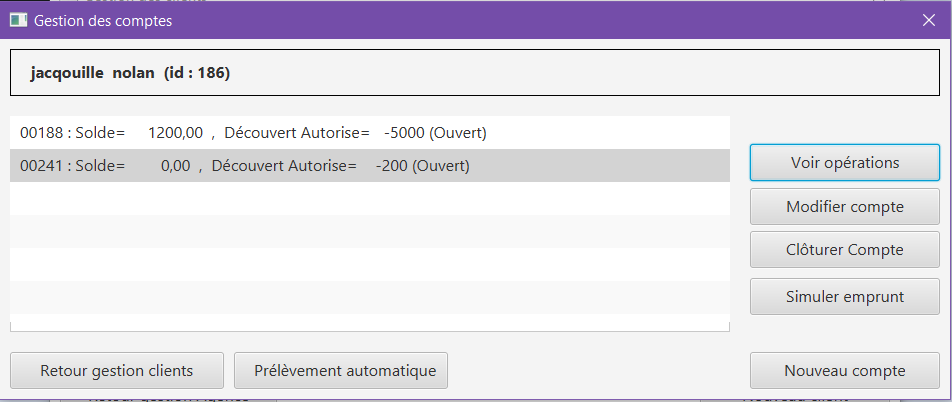

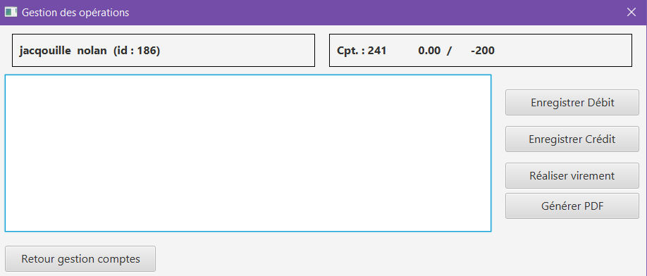

### Enregistrer un débit / crédit

NOTE: Fonctionnalité développer par Yann

*Partie du Use case concerné :*

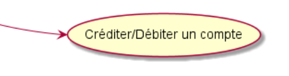

*Partie du diagramme de classe nécessaire :*

*Classes impliquées dans chaque package :*

* package model.orm :
** classe AccessOperation
* package application.view :
** classe OperationsManagementController
** classe OperationEditorPaneController
* package application.control :
** classe OperationEditorPane
** classe OperationsManagement
* package model.data :
** classe CompteCourant
** classe Operation
* package application.tools :
** classe ConstantesIHM
** classe CategorieOperation

La fonction “créditer” est basée sur la fonction “débiter”. On peut donc s’en inspirer pour
réaliser la fonctionnalité cependant la légère différence est que le crédit agit comme un débit
inverse.
Donc dans la classe “AccessOperation” dans le package model.orm il suffit de refaire la
même méthode que “insertDebit” mais en y spécifiant un montant négatif.
Pour le reste des classes à implémenter, celles-ci sont similaires à la fonction “débit”.

*Copies d'écran principale de la fonctionnalité :*

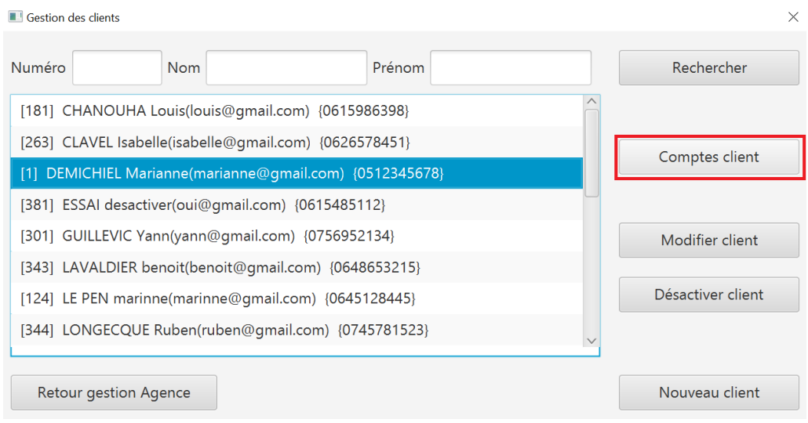

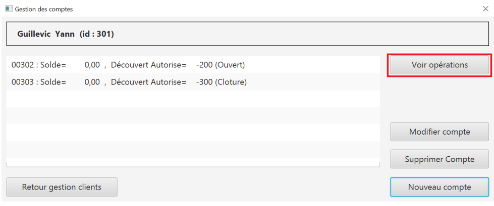

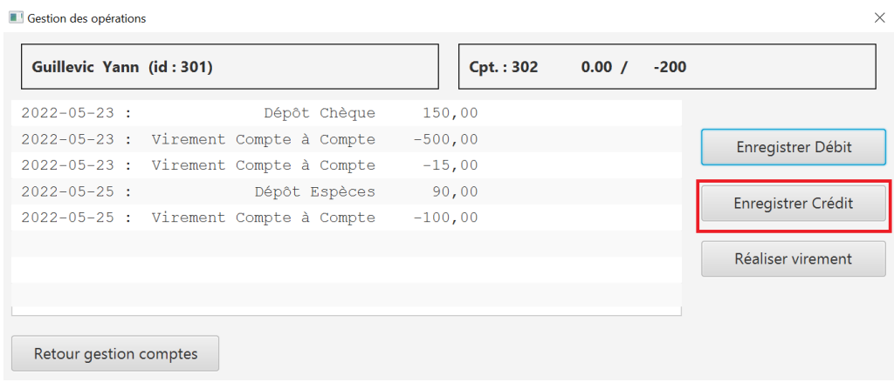

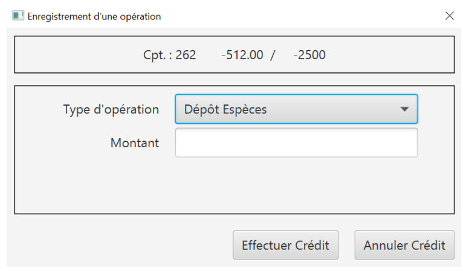

### Réaliser un virement compte à compte

NOTE: Fonctionnalité développer par Yann

*Partie du Use case concerné :*

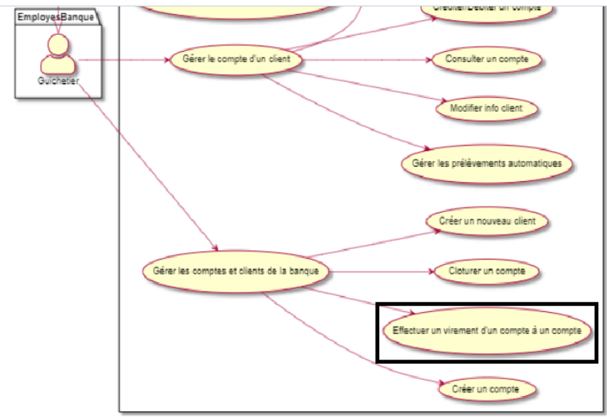

*Partie du diagramme nécessaire :*

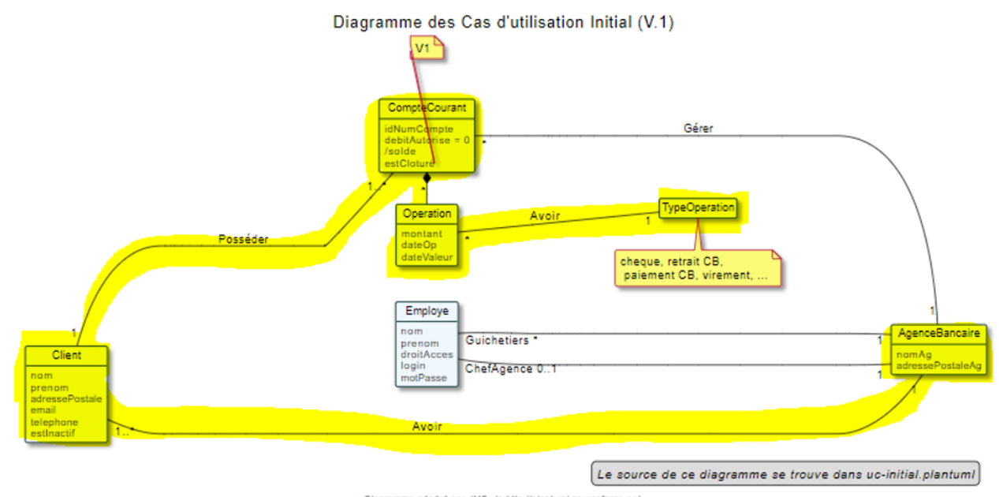

*Classes impliquées dans chaque package :*

* package model.orm :
** classe AccessOperation
** classe AccessCompteCourant
* package application.view :
** classe OperationsManagementController
** classe OperationEditorPaneController
* package application.control :
** classe OperationEditorPane
** classe OperationsManagement
* package model.data :
** classe CompteCourant
** classe Operation
* package application.tools :
** classe ConstantesIHM
** classe CategorieOperation

Lorsque cette fonctionnalité a été codée, l’un des points importants était de récupérer la liste
complète des comptes existant dans la BD.
Dans la classe “AccessCompteCourant” du package model.orm, j’ai donc rajouté la méthode
sans paramètre “getListeCompteCourant” qui retourne une liste (ArrayList) de tous les
comptes existants.
La partie la plus importante de la fonctionnalité se trouve dans la classe
“OperationsManagement” du package application.control dans la méthode
“enregistrerVirement()”.
Ci-dessous un extrait du code de cette méthode dans laquelle on parcours notre liste de
compte et :
Si l’entier saisi (correspondant au numéro de compte à créditer) est égal à un numéro de
compte existant alors on applique; - le débit sur le compte concerné; - le crédit sur le compte
correspondant au numéro saisi.
Sinon on affiche une boîte de dialogue.

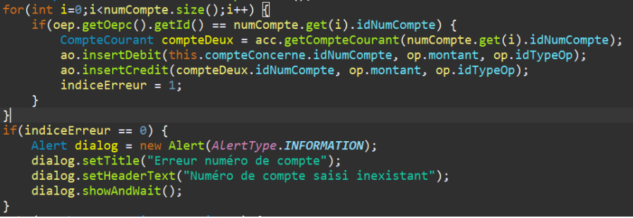

*Copies d'écran principale de la fonctionnalité :*

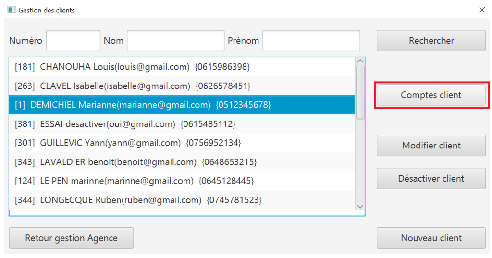

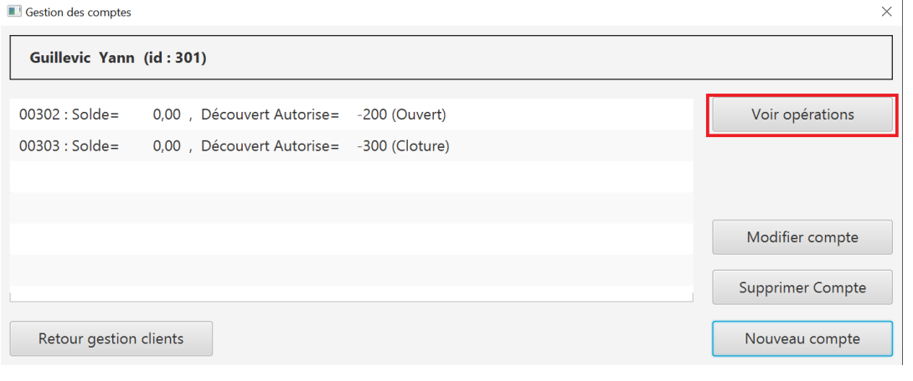

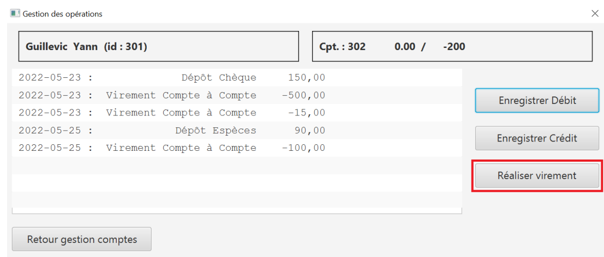

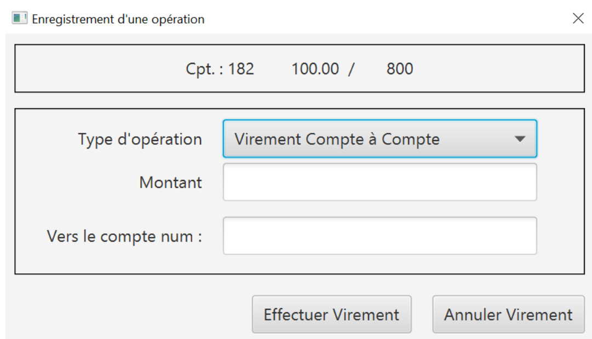

### Générer un relevé bancaire PDF

*Partie du Use case concerné :*

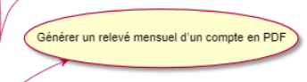

*Partie du diagramme nécessaire :*

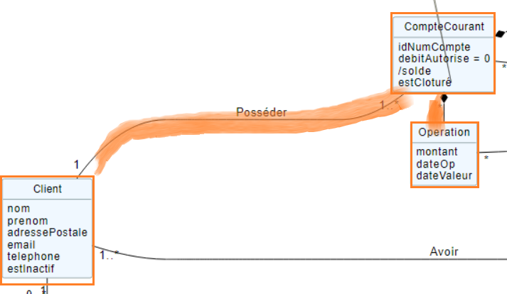

*Classes impliquées dans chaque package :*

* package application.control :
** OperationManagement.java
* package application.view :
** OperationManagementController.java
* package model.data :
** Client.java
** CompteCourant.java
** Operation.java

En cliquant sur le bouton « générer relevé PDF» le contrôleur de vue OperationManagementController fait appel à la librairie itext pour créer un fichier pdf. Ce document contient les informations du client ainsi que de son compte et les opérations de ce compte. 

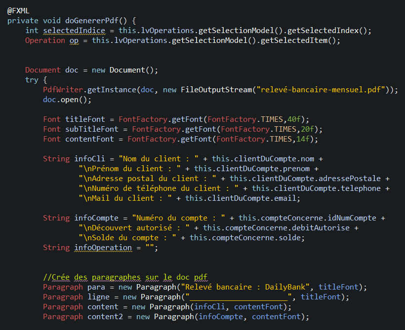

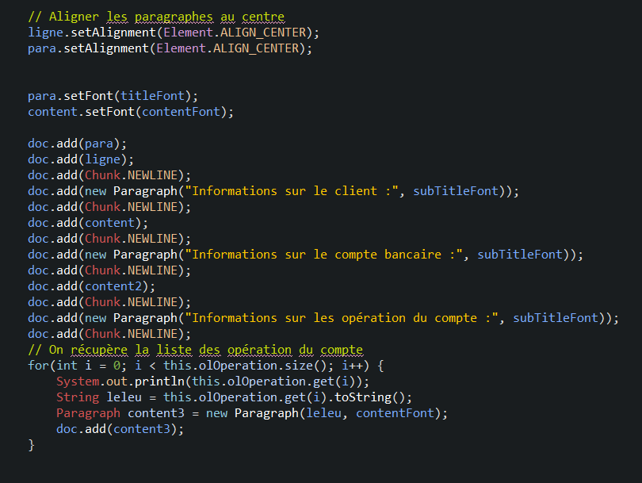
image:img-doc_tech/releve-code3 .png[]

*Copies d'écran principale de la fonctionnalité :*

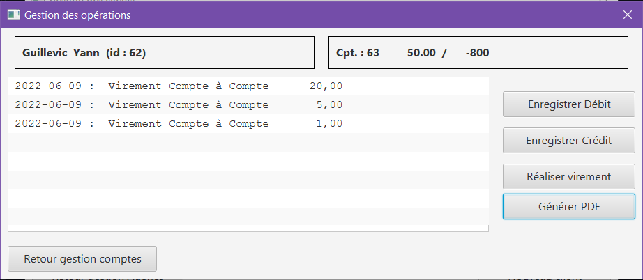

image:img-doc_tech/releve2 .png[]

### Modification d'un compte bancaire

NOTE: Fonctionnalité développer par Christopher

*Partie du Use case concerné :*

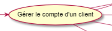

*Partie du diagramme nécessaire :*

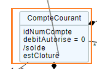

*Classes impliquées dans chaque package :*

* package application.control :
** CompteEditorPane.java
** ComptesManagement.java
* package application.tools :
** EditionMode.java
* package application.view :
** CompteEditorPaneController.java
** ComptesManagementController.java
* package model.data :
** CompteCourant.java
* package model.orm :
** AccessCompteCourant.java

En cliquant sur le bouton « modifier compte » le contrôleur de vue ComptesManagementController transmet les informations au contrôleur ComptesManagement pour afficher la fenêtre de modification d'un client et qui va faire appel à la classe AccessCompteCourant pour modifier le compte avec la méthode updateCompteCourant

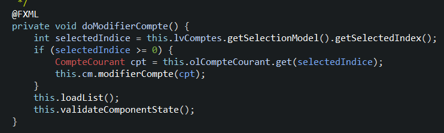

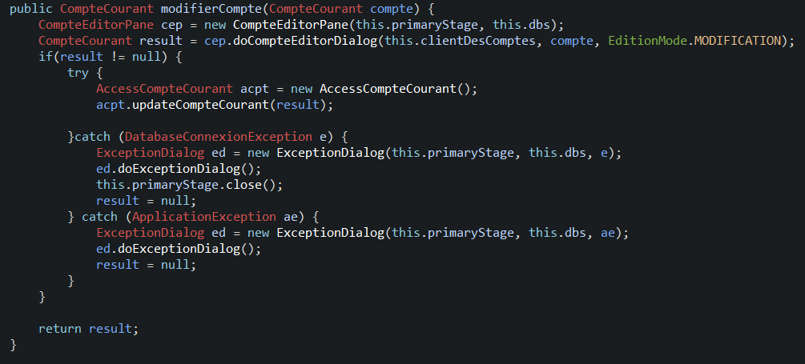


*Copies d'écran principale de la fonctionnalité :*

image:img-doc_tech/modifierCompte1.png[]


### Clôturer / Réactiver un compte bancaire 

NOTE: Fonctionnalité développer par Ruben

*Partie du Use case concerné :*


*Partie du diagramme nécessaire :*


*Classes impliquées dans chaque package :*

* package model.orm :
** classe AccessCompteCourant
* package application.view :
** classe ComptesManagementController
* package application.control :
** classe ComptesManagement
* package model.data :
** classe CompteCourant
* package application.tools :
** classe ConstantesIH

La fonction “Clôturer/Reéactiver un compte” est une nouvelle fonctionnalité qui apparaît
dans la v1. Celle-ci se développe aux travers de 2 classes : AccessCompteCourant et
ComptesManagementController.
D’abord dans AccessCompteCourant, on va créer 2 nouvelles méthodes afin de pouvoir
utiliser une requête SQL afin de mettre à jour les comptes pour d’une part soit les clôturer et
donc mettre leurs soldes à 0 ainsi que les rendre inactifs


Soit les réactiver en leur mettant par défaut un solde de 10 euros et un découvert de -200.


Enfin dans ComptesManagementController, on crée une méthode qui va servir tant pour
clôturer le compte que pour le réactiver et on va adapter la méthode
validateComponentState() qui va rendre accessible certains boutons de la fenêtre selon si le
compte est clôturé où non dans la base de données.


Dans la méthode doCloturerCompte() qui a alors une double fonction, la différenciation de
quel action à effectuer se fait en partie grâce au label affiché par le bouton concerné. En
effet dans validateComponentState(), selon si le compte est clôturé ou non, celui-ci change
le label du bouton concerné afin de marquer la différence d’état (si il est clôturé celui-ci
“demandera” pour le réactiver et inversement). Et donc selon ce qui est écrit cela va lancer
une partie différente de la méthode.
Voici la partie concerné pour clôturer le compte :


Et celle pour réactiver le compte :


Ici j’utilise une boîte de dialogue pour mettre en action la fonctionnalité pour s’assurer que
c’est bien une action volontaire de la part de l’employé.

*Copies d'écran principale de la fonctionnalité :*


### Simuler un emprunt bancaire

NOTE: Fonctionnalité développer par Ruben

*Partie du Use case concerné :*


*Partie du diagramme nécessaire :*

image:img-doc_tech/Emprunt-diagramme.png[]

*Classes impliquées dans chaque package :*

* package application.view :
** classe SimulationEmpruntController
* package application.control :
** classe SimulationEmpruntPane
* package model.data :
** classe Emprunt

Tout d’abord, il est important de savoir que contrairement à ce que “préconise” le diagramme
de classe concernant cette fonctionnalité, j’ai fait le choix arbitraire de développer le tout sur
dans une seule et même classe, que ce soit pour l’emprunt ou l’assurance d’emprunt :


Si j’ai fait ce choix, c’est que je considère qu'étant donné qu’il s’agit d’une simulation ne se
basant sur aucune “véritable donnée”, il est alors pas nécessaire de faire tout un ensemble
de classes plus “compliqué”. Cependant, si il avait été question d’une implémentation plus
poussée, j’aurais effectivement séparé l’ensemble sur plusieurs classes, cela m’aurait
permis de mieux exploiter les informations propre au client et donc créer un emprunt et une
assurance d’emprunt viable pour celui-ci.
Ensuite, lorsque nous utilisons la simulation, nous pouvons remarquer que nous pouvons
effectuer une simulation d’emprunt séparément d’une assurance d’emprunt, et inversement.
Cela s’explique par le simple fait qu’un emprunt peut être pris dans une banque et
l’assurance dans une autre banque et inversement. Donc il était plus judicieux de séparer
ces deux simulations bien que présentes dans la même vue.
Enfin, pour effectuer la gestion d’erreur des TextField contenant les informations
nécessaires, rentré par l’utilisateur, pour effectuer les simulations.
Tout d’abord une méthode appelé toDouble() :


Concrètement, c’est simplement une version plus facile d’utilisation de la méthode déjà
existante Double.parseDouble(). A la différence que celle-ci renvoie -1 si une exception est
trouvée. A partir de ceci, j’associe une autre méthode qui va effectuer la vérification des
champs appelé isSaisieValide() :


Voici un exemple d’un des trois isSaisieValide() présent dans le controller.
La méthode fonctionne ainsi, d’abord elle va créer un objet de type Emprunt, en prenant
pour paramètre les contenus des TextField correspondant aux paramètres. Chaque
paramètre correspond à ce que renvoie la méthode toDouble() sur chaque TextField
sélectionné. Puis, elle effectue des vérifications sur chacun d’eux pour voir s' ils respectent
les conditions nécessaires au bon fonctionnement de la simulation. Si jamais ce n’est pas le
cas, la méthode renvoie un message d’erreur et retourne sur le champ concerné pour que
celui-ci soit complété correctement.

*Copies d'écran principale de la fonctionnalité :*


### Réaliser un débit exceptionnel

*Partie du Use case concerné :*

*Partie du diagramme nécessaire :*

*Classes impliquées dans chaque package :*

*Copies d'écran principale de la fonctionnalité :*

### Créer un nouveau compte bancaire

NOTE: Fonctionnalité développer par Christopher

*Partie du Use case concerné :*


*Partie du diagramme nécessaire :*


*Classes impliquées dans chaque package :*

* package application.control :
** CompteEditorPane.java
** CompteManagement.java
* package application.tools : 
* EditionMode.java
* package application.view :
** CompteEditorPaneController.java
** CompteManagementController.java
* package model.data :
** CompteCourant.java
* package model.orm :
** AccessCompteCourant.java

En cliquant sur le bouton « nouveau compte » le contrôleur de vue CompteManagementController transfère les informations nécessaire au contrôleur CompteManagement pour l'affichage de la fenêtre de création d'un compte bancaire, c'est à dire l'ID du client ainsi que l'ID de l'Agence bancaire. +
Ensuite, après l'ouverture de la fenêtre de création d'un compte bancaire, la classe CompteEditorPane va être utilisée pour transmettre les informations au contrôleur de vue CompteEditorPaneController, c'est à dire le découvert autorisé ainsi que le solde du premier dépôt. +
Ces informations seront stockées dans la base de données grâce à la classe AccessCompteCourant.


Dans cette fonction nous faisons appel à la méthode creerCompte, qui permet de créer un compte bancaire dans la base de données grâce à une requête SQL : 


*Copies d'écran principale de la fonctionnalité :*


### Réaliser un prélévement automatique

*Partie du Use case concerné :*


*Partie du diagramme nécessaire :*


*Classes impliquées dans chaque package :*

* package application.control:
** classe CompteManagement.java
** classe CompteEditorPane.java
** classe PrelevementManagement.java
** classe PrelevementEditorPane.java
* package application.tools:
** classe CategorieOperation.java
** classe ConstantesIHM.java
* package application.view:
** classe CompteManagementController.java
** classe PrelevementManagementController.java
** classe PrelevementEditorPaneController.java
* package model.data:
** Operation.java
** CompteCourant.java
** PrelevementAutomatique.java
** package model.orm:
** AccessPrelevement.java

Un élément important a relevé se trouve au niveau de la création ou de la
modification d’un prélèvement. Pour faire en sorte que les valeurs saisies
correspondent aux valeurs affichées dans la liste, il faut bien les récupérer en
amont pour pouvoir les stocker dans les champs et que les textField puissent
les prendre.
Ci-dessous un exemple de la méthode pour le montant et la date récurrente
d’un prélèvement.


La méthode ci-dessous permet ainsi, d’associer la valeur qui va être montré
dans le textField avec la valeur saisi du nouveau prélèvement ou du
prélèvement édité:
(exemple pour le montant)


*Copies d'écran principale de la fonctionnalité :*


### Modifier les informations d'un client

NOTE: Fonctionnalité de la version existante

*Partie du Use case concerné :*


*Partie du diagramme nécessaire :*


*Classes impliquées dans chaque package :*

* package application.control :
** ClientEditorPane.java
** ClientManagement.java
* package application.tools : 
* EditionMode.java
* package application.view :
** ClientEditorPaneController.java
** ClienteManagementController.java
* package model.data :
** Client.java
* package model.orm :
** AccessClient.java

En cliquant sur le bouton « modifier client » le contrôleur de vue ClientManagementController transmet les informations aux contrôleur ClientManagement qui affichera une fenêtre de modification d'un client et qui ensuite fera appel à la méthode updateClient de la classe AccessClient pour modifier les informations du client. 


*Copies d'écran principale de la fonctionnalité :*


### Désactiver / Réactiver un client

NOTE: Fonctionnalité développer par Ruben

*Partie du Use case concerné :*


*Partie du diagramme nécessaire :*


*Classes impliquées dans chaque package :*

* package application.control :
** ClientManagement.java
* package application.tools : 
* EditionMode.java
* package application.view :
** ClienteManagementController.java
* package model.data :
** Client.java
* package model.orm :
** AccessClient.java
** AccessCompteCourant.java

En cliquant sur le bouton « désactiver client » ou « réactiver client » le contrôleur de vue ClientManagementController selon l'état du client ouvre une fenêtre de confirmation et si la réponse est ok, ce contrôleur de vue fait appel soit à la méthode updateClient de la classe AccessClient et closeCompteClient de la classe AccessCompteCourant pour désactiver le client ainsi que clôturer ses comtes, ou bien à la méthode updateClient de la classe AccessClient et openCompteClient de la classe AccessCompteCourant pour réouvrir les comptes du client.


image:img-doc_tech/desacClient-code4.png[]


*Copies d'écran principale de la fonctionnalité :*


### Création d'un client

NOTE: Fonctionnalité de la version existante

*Partie du Use case concerné :*


*Partie du diagramme nécessaire :*


*Classes impliquées dans chaque package :*

* package application.control :
** ClientEditorPane.java
** ClientManagement.java
* package application.tools : 
* EditionMode.java
* package application.view :
** ClientEditorPaneController.java
** ClienteManagementController.java
* package model.data :
** Client.java
* package model.orm :
** AccessClient.java

En cliquant sur le bouton « nouveau client » le contrôleur de vue ClientManagementController transmet les informations au contrôleur ClientManagement qui va ouvrir une fenêtre de création d'un client en faisant appel à la méthode doClientEditorDialog du contrôleur ClientEditorPane. +
Ensuite; pour créer le client, nous ferrons appel à la méthode insertClient de la classe AccessClient.


*Copies d'écran principale de la fonctionnalité :*


### Gestion des employés

NOTE: Fonctionnalité développer par Yann

*Partie du Use case concerné :*


*Partie du diagramme nécessaire :*


*Classes impliquées dans chaque package :*

* package application.control :
** DailyBankMainFrame.java
** EmployeManagement.java
* package application.view :
** DailyBankMainFrameController.java
* package model.data :
** Employe.java

En cliquant sur le bouton « employés » le contrôleur de vue DailyBankMainFrameController va transmettre les informations au contrôleur DailyBank qui va afficher la fenêtre de gestion des employés grâce à l'appel de la méthode doEmployeManagementDialog du contrôleur EmployeManagement. +

image:img-doc_tech/gererEmp-code1.png[]


*Copies d'écran principale de la fonctionnalité :*


### Recherche des employés

NOTE: Fonctionnalité développer par Yann

*Partie du Use case concerné :*


*Partie du diagramme nécessaire :*


*Classes impliquées dans chaque package :*

* package application.control :
** EmployeManagement.java
* package application.view :
** EmployeManagementController.java
* package model.data :
** Employe.java
* package model.orm :
** AccessEmploye.java

En cliquant sur le bouton « rechercher » le contrôleur de vue EmployeManagementController va transmettre les informations au contrôleur EmployeManagement qui va faire appel à la méthode getEmployes de la classe AccessEmploye pour afficher la liste des employés.


*Copies d'écran principale de la fonctionnalité :*


### Modification des informations d'un employé

NOTE: Fonctionnalité développer par Christopher

*Partie du Use case concerné :*


*Partie du diagramme nécessaire :*


*Classes impliquées dans chaque package :*

* package application.control :
** EmployeEditorPane.java
** EmployeManagement.java
* package application.tools : 
* EditionMode.java
* package application.view :
** EmployeEditorPaneController.java
** EmployeManagementController.java
* package model.data :
** Employe.java
* package model.orm :
** AccessEmpoye.java

En cliquant sur le bouton « modifié employé » le contrôleur de vue EmployeManagementControiller transfère les informations nécessaire au contrôleur EmployeManagement pour l'affichage de la fenêtre de modification d'un employé, c'est à dire :

* son ID
* son nom 
* son prénom
* ses droits d'accès
* son login
* son mot de passe

Ensuite, après l'ouverture de la fenêtre de modification d'un employé, la classe EmployeEditorPane va être utilisée pour transmettre les nouvelles informations au contrôleur de vue EmployeEditorPaneController qui seront mis à jour dans la base de données grâce à la classe AccessEmploye.

image:img-doc_tech/modifierEmp-code1.png[]

Cette fonction fait appel à la méthode modifierEmploye, qui permet de modifier un employé dans la base de données grâce à une requête SQL :


*Copies d'écran principale de la fonctionnalité :*


### Désactivation d'un employé

NOTE: Fonctionnalité développer par Christopher

*Partie du Use case concerné :*

*Partie du diagramme nécessaire :*

*Classes impliquées dans chaque package :*

* package application.control :
** EmployeEditorPane.java
** EmployeManagement.java
* package application.tools : 
* EditionMode.java
* package application.view :
** EmployeEditorPaneController.java
** EmployeManagementController.java
* package model.data :
** Employe.java
* package model.orm :
** AccessEmpoye.java

En cliquant sur le bouton « désactiver employé » le contrôleur de vue EmployeManagementController va afficher une fenêtre de confirmation. +
Ensuite, la classe AccessEmploye va être utilisé pour mettre à jour l'employé dans la base de données.


Cette fonction permet d'afficher une fenêtre d'alerte (de confirmation) et si la réponse est « ok » ont fait appel à la méthode desaEmploye de la classe AccessEmploye :


*Copies d'écran principale de la fonctionnalité :*


### Création d'un nouvel employé

NOTE: Fonctionnalité développer par Christopher

*Partie du Use case concerné :*


*Partie du diagramme nécessaire :*


*Classes impliquées dans chaque package :*

* package application.control :
** EmployeEditorPane.java
** EmployeManagement.java
* package application.tools : 
* EditionMode.java
* package application.view :
** EmployeEditorPaneController.java
** EmployeManagementController.java
* package model.data :
** Employe.java
* package model.orm :
** AccessEmpoye.java

En cliquant sur le bouton « nouveau client » le contrôleur de vue EmployeManagementController transmet les informations au contrôleur EmployeManagement qui fera appel à la méthode doEmployeEditorDialog du contrôleur EmployeEditorPane pour afficher une fenêtre de création d'un employé. +
Ensuite, il fera appel à la méthode insertEmploye de la classe AccessEmploye pour ajouter ce nouvel employé dans la base de données.


*Copies d'écran principale de la fonctionnalité :*


