# DOCUMENTATION UTILISATEUR VERSION 2
:toc: left
:toc-title: Table des matières
:icons: font
:nofooter:

Version de l’application : 1 +
Date : Semaine 20 +
Equipe : Christopher / Ruben / Yaan +
Client : BankUniv +
Projet : Daily Bank +

## Présentation générale

### Objectifs de l'application

L’objectif recherché par la banque DailyBank est de développer une application Java-Oracle de gestion de comptes, pour remplacer plusieurs outils obsolètes. +
Cette nouvelle version de l'appliation permettra de gérer les clients de l'Agence ainsi que leur comptes bancaire. De la même manière, il sera possible de gérer les opérations de chacun de ces comptes. Cette nouvelle version de l'application permettra aussi de gérer les employés de l'Agence bancaire.

## Installation de l'application

Pour pouvoir lancer l'application, l'installation de Java en version 1.8 est nécessaire.
Pour ce faire, vous devez  suivre ces étapes : 

* Télécharger gratuitement la version 1.8 de Java sur le https://www.java.com/fr/download/[site d'Oracle]
** Vous pouvez au préalable vérifiez que l'installation c'est bien réaliser (depuis un terminal) :

    $ java -version 

Ensuite lancer le fichier .jar depuis un terminal (si il ne s'ouvre par en double cliquant dessus) :

(depuis un terminal) :

    $ cd '.\Desktop\DailyBank workspace\'
    $ java -jar Dailybank.jar

## Utilisation de l'application

Il existe deux rôles d'utilisation de l'application : les Guichetiers et les Chefs d'Agences. +
Les guichetiers ont la possibilité de gérer les clients de l'Agence bancaire ainsi que leur comptes bancaire. :

* Consulter les comptes d'un client

** Voir les opération d'un compte

*** Enregistrer un débit 
*** Enregistrer un crédit
*** Réaliser un virement de compte à compte  

** Modifier les informations d'un compte
** Clôturer/Réouvrir un compte
** Créer un nouveau client

* Modifier les information d'un client

* Désactiver/Réactiver un client

* Créer un nouveau client

Les Chefs d'Agence de leur côtés auront ces même droits avec en plus la possibilités de gérer les employés de l'Agence bancaire : 

* Gérer les employés de l'Agence bancaire

** modifier les informations d'un employé 

** Désactiver un employé

** Créer un nouvel employé

## Fonctionnement de l'application

### quitter l'application

TIP: Un bouton « quitter » est accessible depuis l'onglet « utilisateur » 

En cliquant sur le bouton « quitter » une fenêtre de confirmation s'affiche. +
Au clique du bouton « ok » si une connexion avec un compte à été établie, celle-ci s'arrete et la fenêtre de l'application se ferme. +

Au clique du bouton « annuler » l'application continue de fonctionner et la fenêtre de confirmation se ferme.  

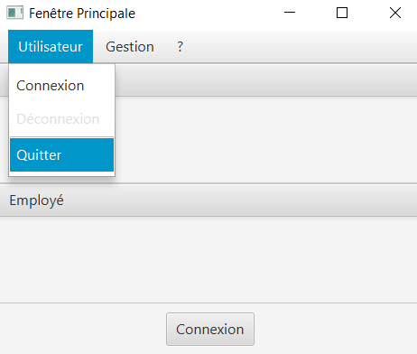

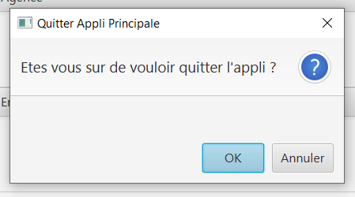

### Connexion à un compte

TIP: Un bouton « connexion »  est accessible depuis l'onglet « utilisateur » 

En cliquant sur le bouton « connexion » une fenêtre d'identification s'affiche. +
Au clique du bouton « valider » une vérifiation des champs de saisie s'effectue. Si ils sont vides, un message d'erreur s'affiche. +
Si le login et le mot de passe appartiennent à un compte de l'Agence, une connexion est établie. +

Au clique du bouton « annuler » aucune connexion n'est établie et la fenêtre d'identification se ferme.

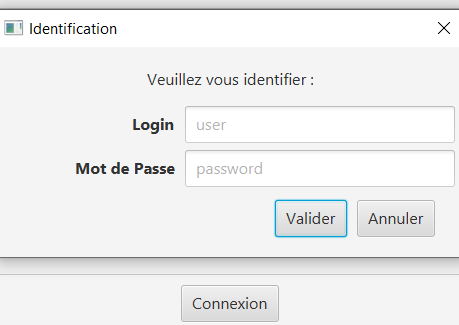

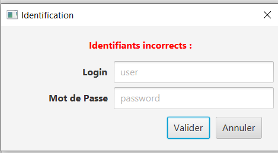

### Deconnexion d'un compte

TIP: Un bouton « deconnexion »  est accessible depuis l'onglet « utilisateur » 

Au clique du bouton « déconnexion », la connexion actuellement établie s'arrête.

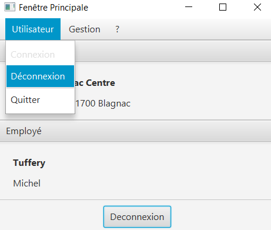

### Gestion des clients

NOTE: Cette fonctionnalité n'est accessible que si l'utilisateur est connectée. +
Cette fonctionnalité est accessible depuis l'onglet « gestion »
Tous les utilisateurs ont accès à cette fonctionnalité.

En cliquant sur le bouton « clients » la fenêtre de gestion des clients s'ouvre.

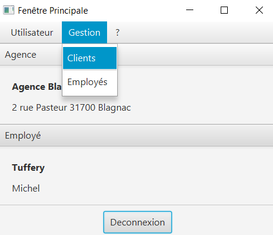

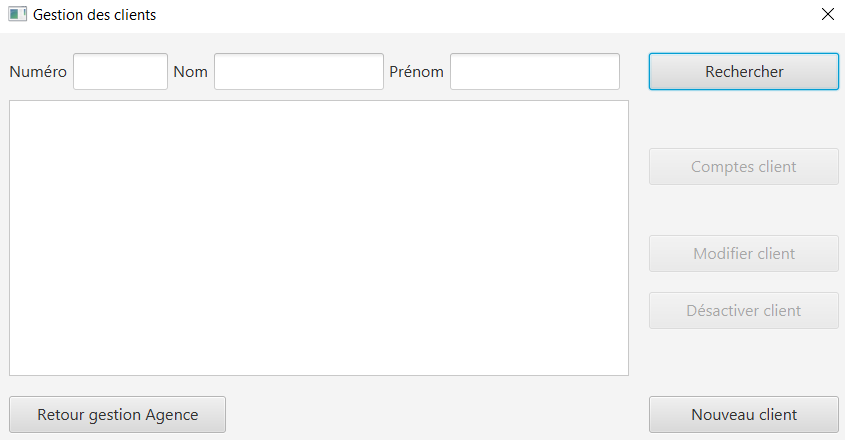

### Recherche d'un client

NOTE: Tous les utilisateurs ont accès à cette fonctionnalité.

En cliquant sur le bouton « rechercher » la liste des clients ainsi que leur informations s'affiche sur la fenêtre. +
Les résultats peuvent être affinés en entrant les informations :

* Numéro (numéro du client)

* Nom

* Prénom

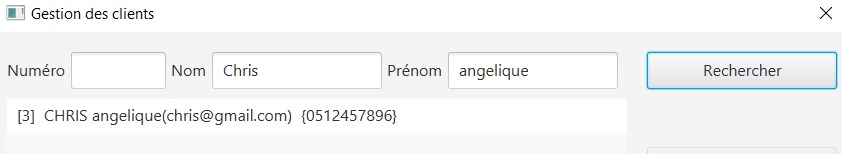

### Gestion des comptes bancaire d'un client

TIP: Un client doit être sélectionner pour effectuer cette action. +
Tous les utilisateur ont accès à cette fonctionnalité

En cliquant sur le bouton « comptes client » la fenêtre de gestion des comptes bancaire d'un client s'ouvre permettant de gérer les compte d'un client.

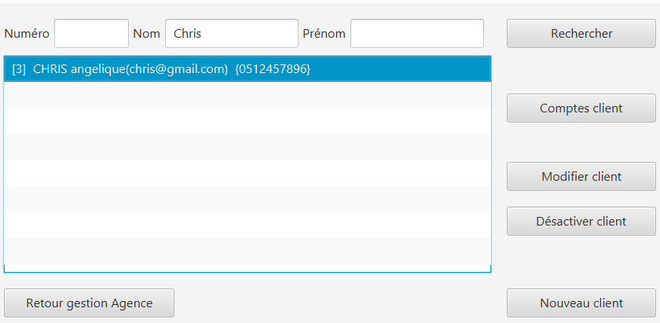

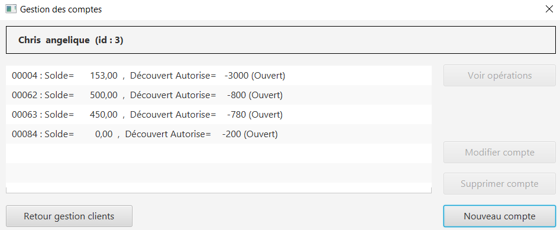

### voir les opération d'un comptes

TIP: Cette fonctionnalité est accessible en sélectionnant un compte. +
Tous les utilisateur ont accès à cette fonctionnalité. +

En cliquant sur le bouton « voir opération » la fenêtre de gestion des opération s'ouvre, permettant à l'utilisateur de gérer les opération d'un compte bancaire.

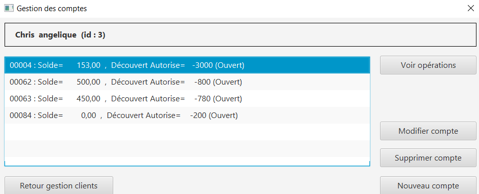

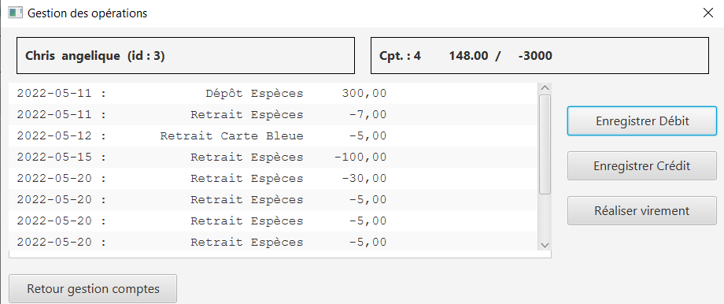

### Enregistrer un débit : développer par Yann

NOTE: Tous les utilisateur ont accès à cette fonctionnalité. +
Cette fonctionnalité est accessible en sélectionnant un compte.

En cliquant sur le bouton « enregistrer débit » une fenêtre d'enregistrement d'une opération s'ouvre. +
En cliquant sur le bouton « effectuer débit » si les préconditions :

* le montant de l'opération ne doit pas être inférieur à 0
* le montant de l'opération ne doit être supérieur au découvert autorisé du compte + au solde du compte. 

sont valides, l'opération s'enregistre et le montant du débit se retire du compte. Ensuite la fenêtre d'enregistrement d'une opération se ferme. +

En cliquant sur le bouton « annuler » l'opération s'annule et la fenêtre d'enregistrement d'une opération se ferme.

### Enregistrer un crédit : développer par Yann

NOTE: Tous les utilisateur ont accès à cette fonctionnalité. +
Cette fonctionnalité est accessible en sélectionnant un compte.

En cliquant sur le bouton « enregistrer crédit » une fenêtre d'enregistrement d'une opération s'ouvre. +
En cliquant sur le bouton « effectuer crédit » si les préconditions :

* le montant de l'opération ne doit pas être inférieur à 0

sont valides, l'opération s'enregistre et le montant du débit s'ajoute au compte. Ensuite la fenêtre d'enregistrement d'une opération se ferme. +

En cliquant sur le bouton « annuler » l'opération s'annule et la fenêtre d'enregistrement d'une opération se ferme.

### Réaliser un virement de compte à compte : développer par Yann

NOTE: Tous les utilisateur ont accès à cette fonctionnalité. +
Cette fonctionnalité est accessible en sélectionnant un compte.

En cliquant sur le bouton « réaliser virement » une fenêtre d'enregistrement d'une opération s'ouvre. +
En cliquant sur le bouton « effectuer virement » si les préconditions :

* le montant de l'opération ne doit pas être inférieur à 0
* le montant de l'opération ne doit être supérieur au découvert autorisé du compte + au solde du compte.
* l'ID du compte qui reçoit le virement doit appartenir à un compte de ce même client.

sont valides, l'opération s'enregistre et le montant du débit s'ajoute au compte qui reçoit l'opération et se retire du compte qui effectue l'opération. Ensuite la fenêtre d'enregistrement d'une opération se ferme. +

En cliquant sur le bouton « annuler » l'opération s'annule et la fenêtre d'enregistrement d'une opération se ferme.

### Modifier un compte bancaire : développer par Christopher

En cliquant sur le bouton « modifier compte » une fenêtre de modification d'un compte bancaire s'affiche. +
En cliquant sur le bouton « modifier » la modification du compte s'enregistre et la fenêtre de modification d'un compte se ferme. +

En cliquant sur le bouton « annuler » la modification s'annule et la fenêtre de modification d'un compte se ferme. 

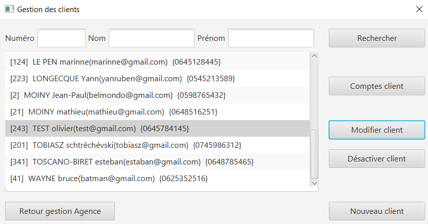

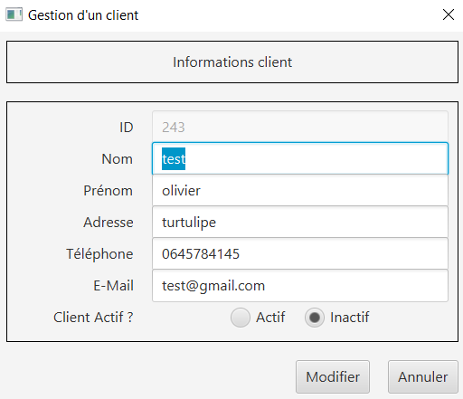

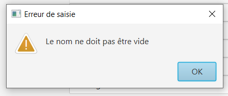

### Clôturer un compte bancaire : développer par Ruben

NOTE: Tous les utilisateurs ont accès à cette fonctionnalité. +
Un compte doit être sélectionner. +
Le compte ne doit pas déjà être clôturer.

En cliquant sur le bouton « clôturer compte » une fenêtre de confirmation s'affiche. +
En cliquant sur le bouton « ok » le compte se clôture et la fenêtre de confirmation se ferme. +

En cliquant sur le bouton « annuler » le compte ne se clôture pas et la fenêtre de confirmation se ferme.

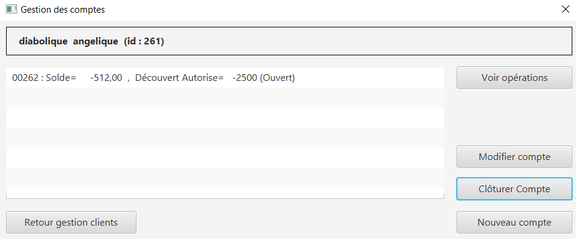

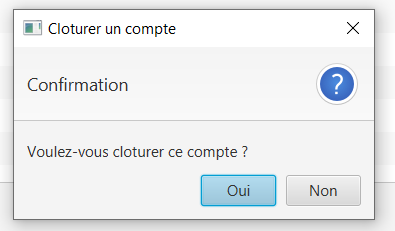

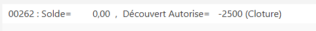

### Réactiver un compte bancaire : développer par Ruben

NOTE: Tous les utilisateurs ont accès à cette fonctionnalités. +
Un compte doit être sélectionner. +
Le compte doit être clôturer.

En cliquant sur le bouton « réactiver compte » une fenêtre de confirmation s'affiche. +
En cliquant sur le bouton « ok » le compte se réactive et la fenêtre de confirmation se ferme. +

En cliquant sur le bouton « annuler » le compte reste clôturer et la fenêtre de confirmation se ferme.

### Création d'un nouveau client

NOTE: Tous les utilisateurs ont accès à cette fonctionnalité.

En cliquant sur le bouton « nouveau client » la fenêtre de création d'un client s'affiche. +
En cliquant sur le bouton « ajouter » les préconditions se vérifie : 

* les champs de saisies ne sont pas vides
* le numéro de téléphone à exactement 10 chiffres
* le mail contient les caractères : @_saisie_._saisie_

Si une préconditions est fausse, une fenêtre d'erreur s'affiche sinon le nouveau client se créer. +

Au clique du bouton « annuler » la création du client s'annule et la fenêtre de création d'un client se ferme.

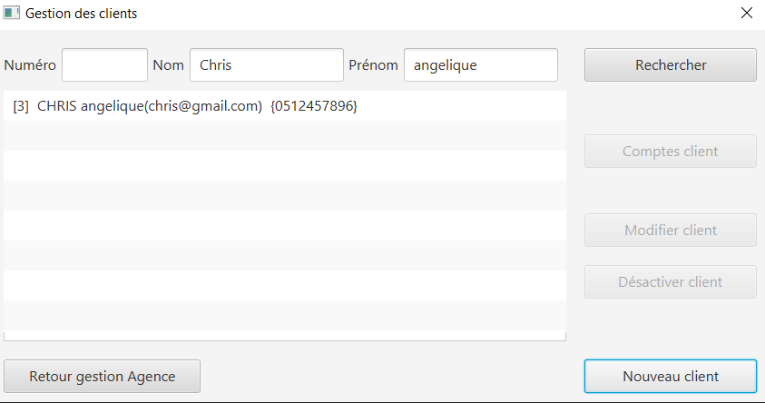

image:img/img2/nouveau-client2.png[]

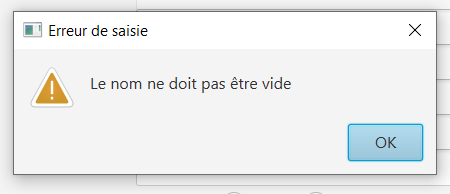

### Modification d'un client

NOTE: Un client doit être sélectionner pour effectuer cette action. +
Tous les utilisateurs ont accès à cette fonctionnalité

En cliquant sur le bouton « modifier client » la fenêtre de modification d'un client s'affiche. +
En cliquant sur le bouton « modifier » les préconditions se vérifie : 

* les champs de saisies ne sont pas vides
* le numéro de téléphone à exactement 10 chiffres
* le mail contient les caractères : @_saisie_._saisie_

Si une préconditions est fausse, une fenêtre d'erreur s'affiche sinon le client se modifie. +

Au clique du bouton « annuler » la modification du client s'annule et la fenêtre de modification d'un client se ferme.

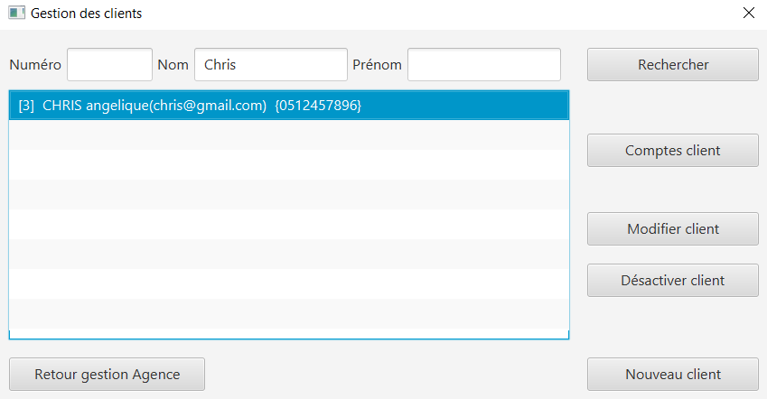

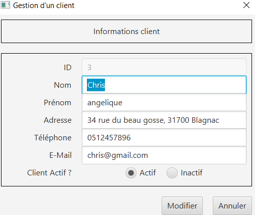

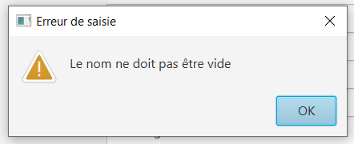

### Désactiver un client : développer par Ruben

NOTE: Tous les utilisateurs ont accès à cette fonctionnalité. +
Un client doit être sélectionner. +
Le client ne doit pas être déjà désactiver.

En cliquant sur le bouton « désactiver client » une fenêtre de confirmation s'affiche. +
En cliquant sur le bouton « ok » le client se désactive et la fenêtre de confirmation se ferme. +

En cliquant sur le bouton « annuler » le client ne se désactiver pas et la fenêtre de confirmation se ferme.

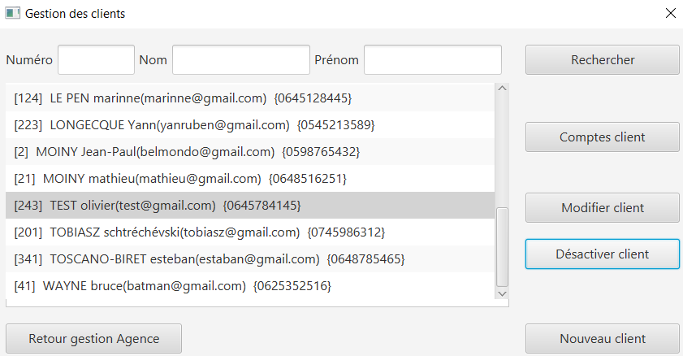

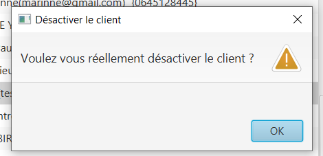

### Gestion des employés de l'Agence

NOTE: Seul les Chef d'Agence ont accès à cette fonctionnalité.

En cliquant sur le bouton « employé » la fenêtre de gestion des employés de l'Agence s'ouvre. 

### Rechercher les employés de l'Agence

NOTE: Seul les Chef d'Agence ont accès à cette fonctionnalité. 

En cliquant sur le bouton « rechercher » la liste des employés de l'Agence s'affiche sur la fenêtre de gestion des employés. +
La recherche peut être affinée avec la saisies des différent champs :

* ID (l'identifiant de l'employé)
* Login 
* MDP (le mot de passe de l'employé)

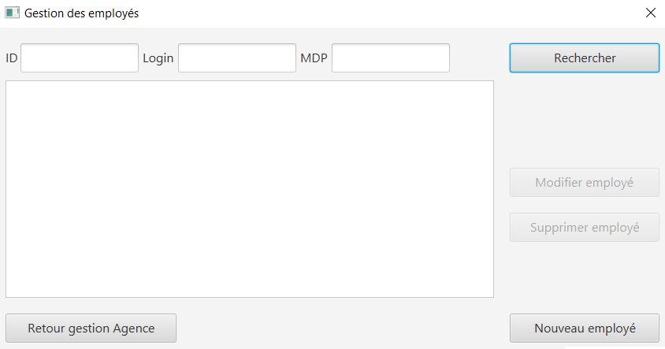

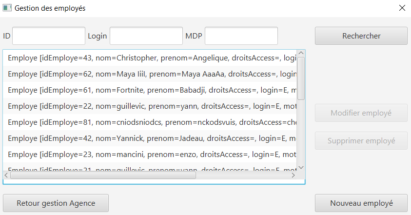

### Modifier un employé : développer par Christopher

NOTE: Seul les Chef d'Agence ont accès à cette fonctionnalité. +
Un employé doit être sélectionner.

En cliquant sur le bouton « modifier employé » la fenêtre de modification d'un employé s'affiche. +
En cliquant sur le bouton « modifier » si les préconditions :

* les différents champs ne doivent pas être vides
* le login et le mot de passe ne doivent pas appartenir à un autre employé

sont valides, la modification s'enregistre sinon une fenêtre d'erreur s'affiche. Ensuite la fenêtre de modification d'un client se ferme. +

En cliquant sur le bouton « annuler » la modification de l'employé s'annule et la fenêtre de modification d'un employé se ferme.

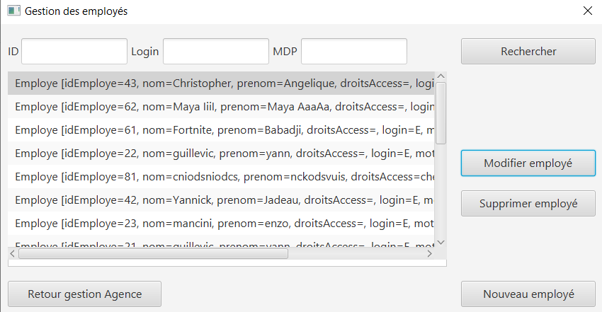

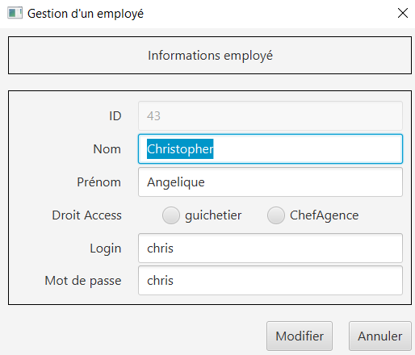

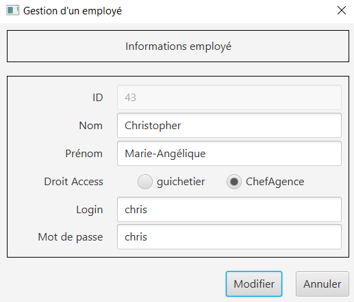

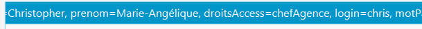

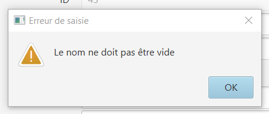

### Désactiver un employé : développer par Christopher

NOTE: Seul les Chef d'Agence ont acès à cette fonctionnalité. +
Un employé doit être sélectionner. +
L'employé ne doit pas être déjà désactiver.

En cliquant sur le bouton « désactiver employé » une fenêtre de confirmation s'affiche. +
En cliquant sur le bouton « ok » l"employé se désactive, c'est-dire que son login et son mot de passe de supprime et il n'est donc plus possible de ce connecter sur son compte. Ensuite la fenêtre de confirmation se ferme. +

En cliquant sur le bouton « annuler » la désactivation de l'employé s'annule et la fenêtre de confirmation se ferme. 

### Créer un nouvel employé : développer par Christopher

NOTE: Seul les Chef d'Agence ont accès à cette fonctionnalité.

En cliquant sur le bouton « nouveau employé » une fenêtre de création d'un employé s'affiche. +
En cliquant sur le bouton « ajouter » si les préconditions :

* les différents champs ne doivent pas être vides 
* le login et le mot de passe ne doivent pas appartenir un employé

sont valides, la création de l'employé s'enregistre, sinon une fenêtre d'erreur s'affiche. Ensuite, la fenêtre de création d'un client se ferme. +

En cliquant sur le bouton « annuler » la création de l'employé s'annule et la fenêtre de création d'un employé se ferme.

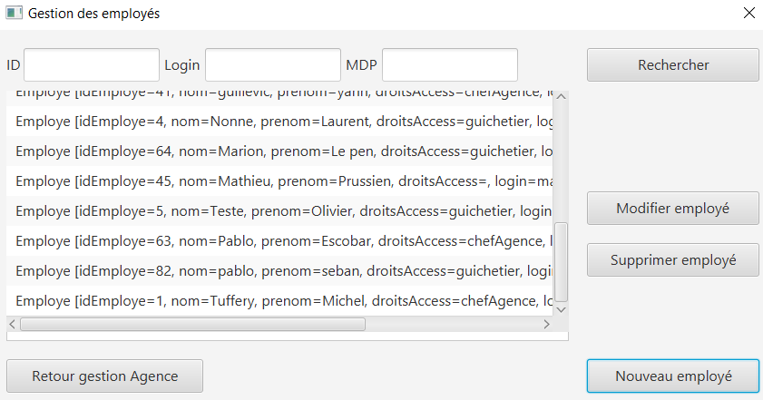

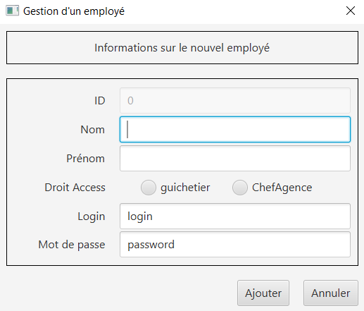

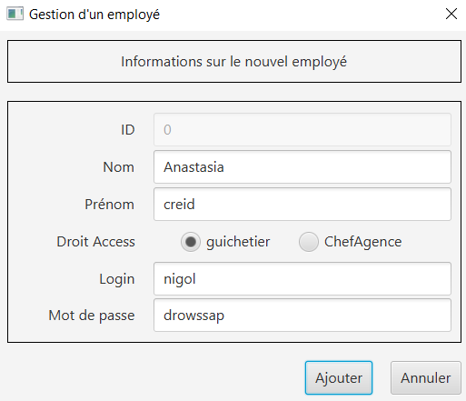

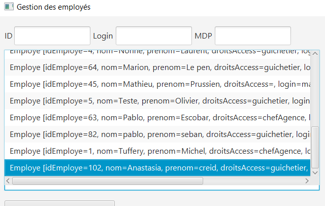

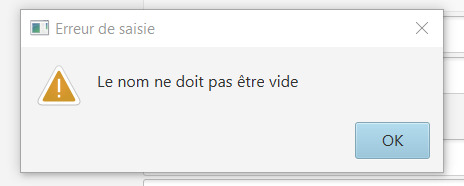

